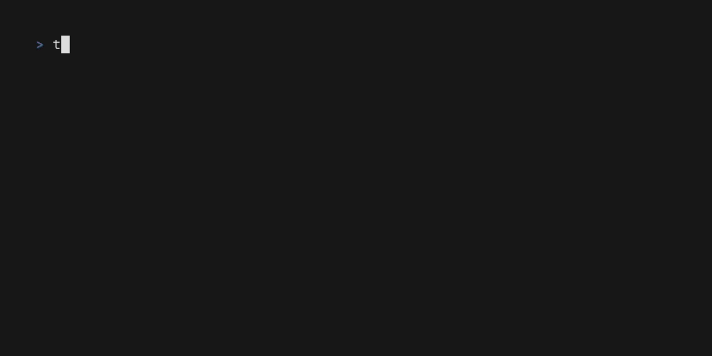

# TMPUser

when you don’t wanna mess up your home directory, but you’re too lazy for containers or VMs.

  
  
  
  

## wat is this?

tl;dr: **temu docker/podman**

TMPUser basically makes your home directory temporarily live in `/tmp`, making other apps think:

> “ah yes, my user’s home directory is `/tmp`. average classic day.”

think of it like chrooting into `/tmp`, but kernel and users and etc stay same, except path and home directory variables

unless.. you just use it to create `/tmp/$user` directory and don't use the main feature of TMPUser. what a psychopath?!

## how does it work?

tl;dr: **magic**, okay just joking, my bad.

basically, it temporarily changes every path to new created "workspace" (aka, directory in your `/tmp` that you created using tmpuser), 

so yes, if you have custom binaries in your `/home`, it wont work there(but you can carry over any files)

## installation

grab latest version in releases(if i’ll ever update lol)

`curl -LO https://github.com/KammyUnix/tmpuser/releases/download/v1.0.0/tmpuser.tar.gz`

then extract it

`tar -xzf tmpuser.tar.gz`

and use it!

`./tmpuser`

**optionally, you can add to PATH**

## known issue

i am too lazy to fix, ignore while hopefully after 10 years, i’ll fix this

## contributing

this shit is held together with tapes and hope, and probably has hundreds of security holes

please, if you can, make this code better🙏
